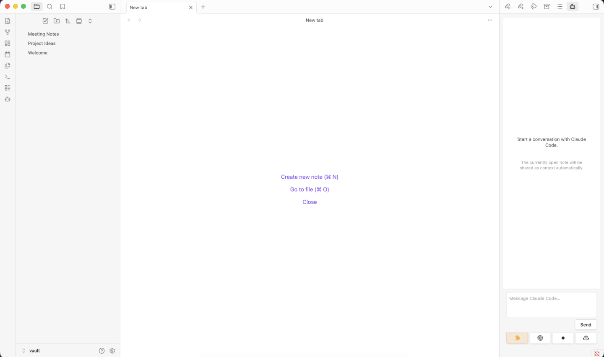
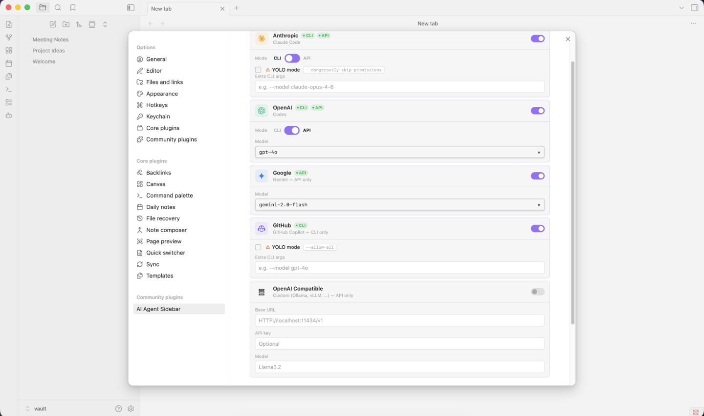

# AI Agent Sidebar for Obsidian

An Obsidian plugin that adds a sidebar where you can chat with AI agents (Claude Code, OpenAI Codex, Google Gemini, GitHub Copilot, and any OpenAI-compatible endpoint) and have them read, create, edit, rename, and delete files in your vault. Agents can be used via their CLI tools or directly through their APIs.

## Features

- **Multi-agent tabs**: Switch between enabled agents without losing conversation history
- **CLI and API modes**: Use agents via their installed CLI tools or directly via API key
- **OpenAI-compatible endpoint support**: Connect to any OpenAI-compatible server (Ollama, vLLM, LM Studio, etc.)
- **Vault CRUD**: Agents can read, create, edit, rename, and delete your notes
- **Streaming responses**: See responses token-by-token as they arrive
- **Auto-context**: The currently open note is automatically shared with the agent
- **Model selection**: In API mode, fetch available models and select one from the settings page
- **Persist conversations**: Optionally save and restore chat history across Obsidian restarts
- **Debug mode**: Optionally show raw CLI output and API request details in the chat panel



## Supported Agents

| Agent | Provider | CLI | API |
| --- | --- | --- | --- |
| Claude Code | Anthropic | ✓ | ✓ |
| OpenAI Codex | OpenAI | ✓ | ✓ |
| Google Gemini | Google | ✗ | ✓ |
| GitHub Copilot | GitHub | ✓ | ✗ |
| OpenAI Compatible | Custom (Ollama, vLLM, …) | ✗ | ✓ |

Obsidian desktop only — mobile is not supported.

## Requirements

At least one of the following must be installed and authenticated:

- **Claude Code** — [docs.anthropic.com](https://docs.anthropic.com/en/docs/claude-code)
- **OpenAI Codex CLI** — [github.com/openai/codex](https://github.com/openai/codex)
- **GitHub Copilot CLI** — [docs.github.com/en/copilot/github-copilot-in-the-cli](https://docs.github.com/en/copilot/github-copilot-in-the-cli)
- **A Google Gemini API key** — Gemini is API-only; no CLI is required
- **An OpenAI-compatible server** — any server that implements the OpenAI chat completions API (e.g. Ollama, vLLM, LM Studio)

## Installation

1. Run `npm run build` to produce `main.js`
2. Copy `main.js`, `manifest.json`, and `styles.css` to:

   ```text
   <vault>/.obsidian/plugins/obsidian-ai-agent-sidebar/
   ```

3. Enable the plugin in **Settings → Community Plugins**
4. Open the AI Agent Sidebar from the ribbon icon or command palette

## API Keys

API mode is available for Claude, Codex, Gemini, and OpenAI-compatible servers. The plugin reads API keys from your shell environment — set them in your shell profile (`.zshrc`, `.bash_profile`, etc.) and restart Obsidian.

For each provider the plugin checks a plugin-specific variable first (`OBSIDIAN_AI_AGENT_SIDEBAR_*`), then falls back to the standard variable used by that provider's own tools. The plugin-specific variables let you create **dedicated API keys** for this plugin so you can track usage from Obsidian separately from other tools (CLIs, scripts, etc.) that share the same provider account.

### Claude (Anthropic)

```text
OBSIDIAN_AI_AGENT_SIDEBAR_ANTHROPIC_API_KEY
ANTHROPIC_API_KEY
```

Get a key at [console.anthropic.com](https://console.anthropic.com).

### Codex (OpenAI)

```text
OBSIDIAN_AI_AGENT_SIDEBAR_OPENAI_API_KEY
OPENAI_API_KEY
```

Get a key at [platform.openai.com](https://platform.openai.com).

### Gemini (Google)

```text
OBSIDIAN_AI_AGENT_SIDEBAR_GEMINI_API_KEY
GEMINI_API_KEY
GOOGLE_API_KEY
```

Get a key at [aistudio.google.com](https://aistudio.google.com).

### GitHub Copilot

Copilot is CLI-only and uses its own authentication (`gh auth login`). No API key is needed.

### OpenAI Compatible

OpenAI-compatible servers that require authentication (e.g. a hosted vLLM instance) read from:

```text
OBSIDIAN_AI_AGENT_SIDEBAR_OPENAI_COMPAT_API_KEY
OPENAI_COMPAT_API_KEY
```

Local servers like Ollama do not require an API key — leave the field blank or set any non-empty placeholder.

## Configuration



Open **Settings → AI Agent Sidebar** to configure each provider.

### Access Mode (CLI vs API)

For agents that support both, a toggle switches between CLI and API mode. CLI mode invokes the installed tool; API mode calls the provider's API directly using your key.

- **CLI mode**: shows an Extra CLI Args field and (where supported) a YOLO mode option
- **API mode**: shows a model selector populated from the provider's live model list

### YOLO Mode

When enabled, the following flags are prepended to every CLI invocation, disabling interactive confirmation prompts:

| Agent | YOLO flags |
| --- | --- |
| Claude Code | `--dangerously-skip-permissions` |
| OpenAI Codex | `--full-auto` |
| GitHub Copilot | `--allow-all` |

### OpenAI-Compatible Agent

The OpenAI-compatible agent connects to any server that implements the OpenAI chat completions API. Configure it in Settings:

| Field | Description |
| --- | --- |
| **Base URL** | The root URL of your server's API, e.g. `http://localhost:11434/v1` for Ollama |
| **Model** | The model name to use, e.g. `llama3.2`, `qwen2.5:1.5b`, `mistral` |
| **API Key** | Optional — required only if your server enforces authentication |

The plugin does not fetch a model list for OpenAI-compatible endpoints — enter the model name directly.

### Default Models (API mode)

If the model list cannot be fetched, the plugin falls back to these defaults:

| Agent | Default models |
| --- | --- |
| Claude | `claude-sonnet-4-6`, `claude-opus-4-6`, `claude-haiku-4-5-20251001` |
| Codex | `gpt-4o`, `gpt-4o-mini`, `o1`, `o1-mini` |
| Gemini | `gemini-2.0-flash`, `gemini-1.5-pro`, `gemini-1.5-flash` |

### Global Options

| Option | Default | Description |
| --- | --- | --- |
| Persist conversations | Off | Save and restore chat history across Obsidian restarts |
| Debug mode | Off | Show raw CLI output and API request details in the chat panel |

## Vault Operations

Agents can perform the following file operations on your vault:

| Operation | Description |
| --- | --- |
| `read` | Read the contents of a file |
| `write` | Create or overwrite a file (parent folders are created automatically) |
| `delete` | Delete a file — always requires your confirmation |
| `rename` | Rename or move a file |
| `list` | List the contents of a directory |

The plugin intercepts structured operation blocks emitted by the agent, executes them via Obsidian's vault API, and displays file operation cards in the chat showing what was done and whether it succeeded.

All file paths are validated against the vault root to prevent directory traversal. Delete operations always show a confirmation dialog before executing.

## Accessing Files Outside the Vault

This plugin accesses files outside your Obsidian vault in two situations:

**Shell profile files (always, on startup)**
On macOS and Linux, GUI applications inherit a stripped environment that omits `PATH` entries added by Homebrew, nvm, Volta, and similar tools, and omits API key variables set in shell profiles. To work around this, the plugin spawns your login shell (`$SHELL -l -c env`) once at startup and reads the resulting environment. This causes your shell profile files (`.zshrc`, `.bash_profile`, `.profile`, etc.) to be executed, which is the only way to reliably locate CLI tools and read API keys set in those files. No profile file content is stored or transmitted — only the resolved environment variables are used.

**CLI tool processes (CLI mode only)**
In CLI mode the plugin spawns `claude`, `codex`, or `copilot` as a subprocess. These are full programs that run with access to your entire filesystem, not just the vault. The plugin's own file-operation protocol (the `:::file-op` blocks) validates all paths against the vault root and rejects traversal attempts, but the CLI tools themselves are not sandbox-constrained by the plugin. A user prompt that asks the agent to read or modify files outside the vault could result in the CLI tool doing so. In YOLO mode, confirmation prompts inside the CLI tool are also disabled. Use CLI mode only with agents and prompts you trust.

## Network Use

This plugin contacts external services. All network requests are initiated by user action (sending a message or fetching the model list) — no background network calls are made.

| Service | Endpoint | When contacted | Why |
| --- | --- | --- | --- |
| Anthropic API | `api.anthropic.com` | API mode only | Send messages to Claude and list available models |
| OpenAI API | `api.openai.com` | API mode only | Send messages to Codex/GPT and list available models |
| Google Generative AI API | `generativelanguage.googleapis.com` | API mode only | Send messages to Gemini and list available models |
| OpenAI-compatible server | Configured base URL | API mode only | Send messages to the local or hosted endpoint |
| Claude Code CLI | Anthropic servers (via `claude` binary) | CLI mode only | The `claude` CLI handles its own network calls to Anthropic |
| OpenAI Codex CLI | OpenAI servers (via `codex` binary) | CLI mode only | The `codex` CLI handles its own network calls to OpenAI |
| GitHub Copilot CLI | GitHub servers (via `copilot` binary) | CLI mode only | The `copilot` CLI handles its own network calls to GitHub |

In API mode the plugin communicates directly with provider APIs using your API key. In CLI mode the plugin spawns the installed CLI tool as a subprocess; all network communication is handled by that tool using its own authentication.

## Privacy

When you use this plugin, the content of your open note and any files the agent reads are sent to the AI provider's servers. **Do not use this plugin with notes containing confidential, sensitive, or personally identifiable information you do not want transmitted to third-party AI services.**

When using an OpenAI-compatible endpoint pointed at a local server (e.g. Ollama), your content stays on your machine.

## Building

```sh
npm install
npm run build   # production build
npm run dev     # watch mode for development
```

## License

MIT
